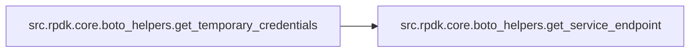
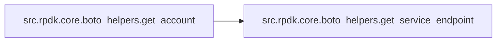

# Src Rpdk Core

[_Documentation generated by Documatic_](https://www.documatic.com)

<!---Documatic-section-Codebase Structure-start--->
## Codebase Structure

<!---Documatic-block-system_architecture-start--->
```mermaid
None
```
<!---Documatic-block-system_architecture-end--->

# #
<!---Documatic-section-Codebase Structure-end--->

<!---Documatic-section-src.rpdk.core.boto_helpers.get_temporary_credentials-start--->
## [src.rpdk.core.boto_helpers.get_temporary_credentials](3-src_rpdk_core.md#src.rpdk.core.boto_helpers.get_temporary_credentials)

<!---Documatic-section-get_temporary_credentials-start--->


### Object Calls

* [src.rpdk.core.boto_helpers.get_service_endpoint](3-src_rpdk_core.md#src.rpdk.core.boto_helpers.get_service_endpoint)

<!---Documatic-block-src.rpdk.core.boto_helpers.get_temporary_credentials-start--->
<details>
	<summary><code>src.rpdk.core.boto_helpers.get_temporary_credentials</code> code snippet</summary>

```python
def get_temporary_credentials(session, key_names=BOTO_CRED_KEYS, role_arn=None):
    sts_client = session.client('sts', endpoint_url=get_service_endpoint('sts', session.region_name), region_name=session.region_name)
    if role_arn:
        session_name = 'CloudFormationContractTest-{:%Y%m%d%H%M%S}'.format(datetime.now())
        try:
            response = sts_client.assume_role(RoleArn=role_arn, RoleSessionName=session_name, DurationSeconds=900)
        except ClientError:
            LOG.debug('Getting session token resulted in unknown ClientError. ' + "Could not assume specified role '%s'.", role_arn)
            raise DownstreamError() from Exception("Could not assume specified role '{}'".format(role_arn))
        temp = response['Credentials']
        creds = (temp['AccessKeyId'], temp['SecretAccessKey'], temp['SessionToken'])
    else:
        frozen = session.get_credentials().get_frozen_credentials()
        if frozen.token:
            creds = (frozen.access_key, frozen.secret_key, frozen.token)
        else:
            try:
                response = sts_client.get_session_token(DurationSeconds=900)
            except ClientError as e:
                LOG.debug('Getting session token resulted in unknown ClientError', exc_info=e)
                raise DownstreamError('Could not retrieve session token') from e
            temp = response['Credentials']
            creds = (temp['AccessKeyId'], temp['SecretAccessKey'], temp['SessionToken'])
    return dict(zip(key_names, creds))
```
</details>
<!---Documatic-block-src.rpdk.core.boto_helpers.get_temporary_credentials-end--->
<!---Documatic-section-get_temporary_credentials-end--->

# #
<!---Documatic-section-src.rpdk.core.boto_helpers.get_temporary_credentials-end--->

<!---Documatic-section-src.rpdk.core.boto_helpers.get_service_endpoint-start--->
## [src.rpdk.core.boto_helpers.get_service_endpoint](3-src_rpdk_core.md#src.rpdk.core.boto_helpers.get_service_endpoint)

<!---Documatic-section-get_service_endpoint-start--->
<!---Documatic-block-src.rpdk.core.boto_helpers.get_service_endpoint-start--->
<details>
	<summary><code>src.rpdk.core.boto_helpers.get_service_endpoint</code> code snippet</summary>

```python
def get_service_endpoint(service, region):
    loader = botocore.loaders.create_loader()
    data = loader.load_data('endpoints')
    resolver = botocore.regions.EndpointResolver(data)
    endpoint_data = resolver.construct_endpoint(service, region)
    return 'https://' + endpoint_data['hostname']
```
</details>
<!---Documatic-block-src.rpdk.core.boto_helpers.get_service_endpoint-end--->
<!---Documatic-section-get_service_endpoint-end--->

# #
<!---Documatic-section-src.rpdk.core.boto_helpers.get_service_endpoint-end--->

<!---Documatic-section-src.rpdk.core.boto_helpers.get_account-start--->
## [src.rpdk.core.boto_helpers.get_account](3-src_rpdk_core.md#src.rpdk.core.boto_helpers.get_account)

<!---Documatic-section-get_account-start--->


### Object Calls

* [src.rpdk.core.boto_helpers.get_service_endpoint](3-src_rpdk_core.md#src.rpdk.core.boto_helpers.get_service_endpoint)

<!---Documatic-block-src.rpdk.core.boto_helpers.get_account-start--->
<details>
	<summary><code>src.rpdk.core.boto_helpers.get_account</code> code snippet</summary>

```python
def get_account(session, temporary_credentials):
    sts_client = session.client('sts', endpoint_url=get_service_endpoint('sts', session.region_name), region_name=session.region_name, aws_access_key_id=temporary_credentials['accessKeyId'], aws_secret_access_key=temporary_credentials['secretAccessKey'], aws_session_token=temporary_credentials['sessionToken'])
    response = sts_client.get_caller_identity()
    return response.get('Account')
```
</details>
<!---Documatic-block-src.rpdk.core.boto_helpers.get_account-end--->
<!---Documatic-section-get_account-end--->

# #
<!---Documatic-section-src.rpdk.core.boto_helpers.get_account-end--->

[_Documentation generated by Documatic_](https://www.documatic.com)